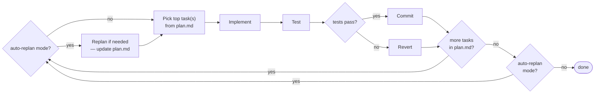
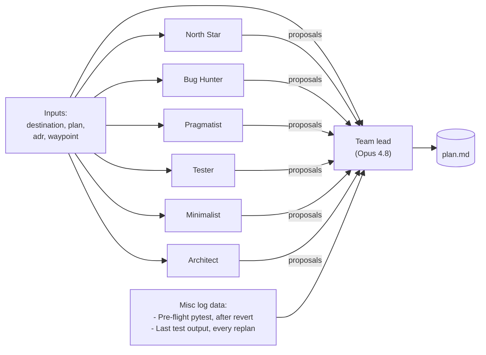

```
 █████╗ ██╗   ██╗████████╗ ██████╗ ███████╗██████╗ ██████╗ ██╗███╗   ██╗████████╗
██╔══██╗██║   ██║╚══██╔══╝██╔═══██╗██╔════╝██╔══██╗██╔══██╗██║████╗  ██║╚══██╔══╝
███████║██║   ██║   ██║   ██║   ██║███████╗██████╔╝██████╔╝██║██╔██╗ ██║   ██║
██╔══██║██║   ██║   ██║   ██║   ██║╚════██║██╔═══╝ ██╔══██╗██║██║╚██╗██║   ██║
██║  ██║╚██████╔╝   ██║   ╚██████╔╝███████║██║     ██║  ██║██║██║ ╚████║   ██║
╚═╝  ╚═╝ ╚═════╝    ╚═╝    ╚═════╝ ╚══════╝╚═╝     ╚═╝  ╚═╝╚═╝╚═╝  ╚═══╝   ╚═╝

              Describe the destination only. Autosprint takes you there.
```

<p align="center">
  
</p>

<p align="center">
  <a href="https://www.python.org/downloads/"></a>
  <a href="LICENSE"></a>
  <a href="https://github.com/astral-sh/uv"></a>
  
</p>

---

# TL;DR

You write down what you want in `destination.md`. Autosprint measures the gap between that target state and your repo as it stands today, decomposes the gap into a sequence of small steps, and executes them one at a time. With `--auto-replan` it will automatically create the next batch of steps and execute them once the initial plan is completed.

- **Plan** — a team of AI agents reads `destination.md` and your code, each independently drafts a list of next tasks, and a team lead merges them into one ordered `plan.md`.
- **Implement** — an AI agent picks the top pending task, writes the code, and writes tests for the change.
- **Test** — the target repo's own test suite runs (pytest or vitest, not LLM judgment).
- **Commit** — if tests pass, the sprint is committed. If not, the working tree is reverted and the next sprint plans around the failure.

By default (reviewed-plan mode), autosprint runs through a human-approved `plan.md` top to bottom and stops when the list empties — `MAX_SPRINTS` and your own `autosprint stop` are the other exit doors. With `--auto-replan`, once the initial plan finishes autosprint re-measures the gap and drafts a fresh plan, repeating sprint after sprint until you stop it or the destination is genuinely reached.

# Prerequisites

Always required:

- Python 3.12+ ([install](https://www.python.org/downloads/))
- [`uv`](https://docs.astral.sh/uv/getting-started/installation/) (Python package manager)
- `git`

Plus **one or both** of the AI backends below, depending on which team you'll run. The default `council` team mixes both, so most users install both. Single-backend teams (e.g. `solo` is Claude-only, `solo_gpt55` is Copilot-only) only need the matching one. Run `autosprint teams` to see which backends each team uses, and `autosprint doctor` to verify the ones your configured team needs.

- **For Claude/Opus agents** (e.g. `solo`, `solo_opus`, default `council` includes them): [Node.js](https://nodejs.org/en/download) + `npm install -g @anthropic-ai/claude-code && claude login`
- **For Copilot/GPT-5.5 agents** (e.g. `solo_gpt55`, `trio_gpt55`, default `council` includes them): the [GitHub CLI](https://cli.github.com/) (`gh`), then `gh auth login`

## Installing autosprint

```bash
git clone https://github.com/haakonbull/autosprint.git
uv tool install --editable ./autosprint
```

This puts an `autosprint` command on your PATH that always runs the current state of the clone (the install is editable, so `git pull` takes effect immediately). autosprint runs from the clone but operates on *your* project — the repo you are standing in. Every example below assumes `autosprint` is on PATH.

> **Avoid the alias alternative** (`alias autosprint='uv run --project /path/to/autosprint autosprint'`): it re-syncs autosprint's own venv on every invocation, which is slower and fails with a file-lock error when a loop is already running — e.g. `autosprint stop` from a second terminal dies with *Access is denied* instead of stopping the run.

### Updating autosprint

When you pull a newer version of autosprint, code changes take effect immediately (the tool install is editable). If `pyproject.toml` dependencies changed, reinstall; then refresh the bundled skills in any target repo you've already initialised:

```bash
# In the autosprint clone:
cd /path/to/autosprint
git pull
uv tool install --reinstall --editable .   # only needed when dependencies changed

# Then in each target repo where you want the new skills/agents:
cd /path/to/your-target-repo
autosprint init --update-skills
```

`init --update-skills` overwrites `.claude/skills/`, `.claude/agents/`, and `.github/skills/` with the autosprint source versions. Other init artefacts (config.toml, destination.md, .gitignore) are left untouched.

# First run

**Prerequisite:** finish [Installing autosprint](#installing-autosprint) above first — clone the repo and `uv tool install --editable` it so `autosprint` is callable from any directory.

Two paths below: a **quick start** that runs autosprint against a built-in demo destination (a small 3D action game) so you can see the loop work in ~2 minutes, and a **real project** path where you write your own destination.

## Quick start — see the loop work

Copy-paste one line at a time (PowerShell doesn't chain with `&&` in older versions). After `autosprint init`, the wizard asks 3 questions (target language, AI backend, enable auto-gates) — accept defaults or pick your backend.

### Python project (uv + pytest)

```bash
mkdir my-game
cd my-game
git init
uv init --package                                       # creates src/my_game/ package layout
uv add --dev pytest                                     # creates .venv, installs the package editable, AND adds pytest — required for autosprint's pre-flight gates
autosprint init                                         # seeds autosprint/examples/ with destination templates
cp autosprint/examples/destination_game.example.md autosprint/destination.md
git add .
git commit -m "init"
autosprint run --auto-replan
```

### TypeScript / JavaScript project (npm + vitest)

```bash
mkdir my-game
cd my-game
git init
npm init -y
npm install -D vitest typescript                        # autosprint needs vitest on PATH to gate sprints
autosprint init                                         # seeds autosprint/examples/ + a Node/TS .gitignore so `git add .` doesn't suck in node_modules/
cp autosprint/examples/destination_game.example.md autosprint/destination.md
git add .
git commit -m "init"
autosprint run --auto-replan
```

`autosprint run --auto-replan` starts the loop with autosprint re-planning each sprint as it goes (no hand-review needed). The seeded demo destination is a small 3D action game — concrete enough that the planner can produce real tasks immediately. After ~5–10 sprints you'll have a working baseline.

### Pick a different demo

Several destination templates ship in `autosprint/examples/` after init:

- **`destination_game.example.md`** — small 3D action game with mouse-aim, LMB/RMB, WASD, jump, weapon switch, and explosions. **Default seed.** Worked example for a code project.
- **`destination_research_ai_bubble.example.md`** — long-form, source-backed research paper: weighted scenarios for AI stocks through end-2026, rendered as a journal-style PDF. Worked example for a non-code (markdown-deliverable) project.
- **`destination_full_template.md`** — every section of the spec with prompts inline. Use when you want to write your own destination from scratch.
- **`destination_concerns_checklist.md`** — a walkthrough for deciding *which* sections your destination should include.

To use the research demo instead, replace the `cp` line with:

```bash
cp autosprint/examples/destination_research_ai_bubble.example.md autosprint/destination.md
```

## Real project — write your own destination

For an actual project, skip the quick start above. Replace the demo destination with one that describes your repo's target state, and review the plan before running:

### 1. Describe the destination

**1.1 Make sure you're in a git repo.** `cd` into the repo you want autosprint to work on. If it isn't a git repo yet, run `git init` first — autosprint refuses to start without one (the commit/revert flow depends on it). Your project's own dependencies (`uv sync` / `poetry install` / `npm install` / etc.) should already be installed so the test suite can run.

**1.2 Run `autosprint init`.** A short interactive wizard asks three questions:

- target language (auto-detected from marker files — usually just confirm)
- AI backend (Claude only / Copilot only / both)
- enable auto-detected per-sprint gates? (format-check, lint-check, coverage-track — recommended Y)

It then writes `autosprint/config.toml`, seeds `autosprint/examples/` with destination templates and `autosprint/adr.md`, plus a `.gitignore` block, and copies skill + agent prompts into `.claude/`. Pass `--yes` to skip the wizard and accept defaults. Full file map: [Target-repo layout](#target-repo-layout).

**1.3 (Optional) Drop reference material into your own `docs/` folder.** A Figma export, a data-model sketch, an external spec — anything the planner should be able to consult. Create the folder yourself if you don't already have one; autosprint doesn't seed it.

**1.4 Edit `destination.md`.** Describe what the end product should be, the properties that matter, and the trade-offs you accept. Reference files in `docs/` where it helps.

**1.5 Run the `grill-destination` skill.** It interviews you to make sure `destination.md` has enough for the planner to work from. Two modes: **fresh** (greenfield project) and **mature-repo** (extracts a draft from your existing code, then walks you through validation).

## 2. Plan the route

**2.1 Run `autosprint plan`**: A team of 6 agents + team lead reads `destination.md` and your current codebase, then writes `autosprint/plan.md` — a candidate route of ~15–30 ordered tasks. Pick a different team with `autosprint plan --team <name>` (see [Built-in teams](#built-in-teams)).

**2.2 Review `plan.md` by hand**: Prune, reorder, sharpen. The `grill-plan` skill walks you through it.

## 3. Run the sprints

**3.1 Commit any pending work**: `autosprint run` cuts a fresh `autosprint/<timestamp>` branch, and **uncommitted edits carry over** into it (they'll be folded into the first green sprint commit). Commit or stash anything you don't want auto-bundled. autosprint will prompt Y/N if it finds an unclean working tree; pass `--commit-on-start` to skip the prompt.

**3.2 Run `autosprint run` in your terminal**: This starts a loop where each iteration is one **sprint** — one leg of the route. Each sprint:

- Picks the top task from `plan.md`, or bundles a few small ones up to the story-point target.
- Implements the change in your repo (creates / edits / removes code).
- Runs the test suite.
- Commits on green; reverts on red. The working tree always matches the last green commit.

The run ends when the plan is drained, when `MAX_SPRINTS` is hit (default 100, auto-sized to 2× the plan length in reviewed-plan mode when the default is in effect), or when you stop it (see the [CLI cookbook](#cli-cookbook) for stop commands).

# Run modes

The three steps above describe a default run — review the plan, then execute it. Two flags vary that behavior.

## Hands-off mode: `--auto-replan`

`autosprint run --auto-replan` runs the same loop without the human review step. When the current plan is drained, autosprint reads the gap to `destination.md` and generates a new plan automatically — keeping the loop going until `MAX_SPRINTS` is reached or you stop it. Raise the sprint cap with `--max-sprints N`.

## Prioritize a task: `--prioritize`

When you want a specific task surfaced near the top of the next plan — a small thing you want done now, a section of `destination.md` to focus on this run, or a fresh idea you just had — pass a freeform priority hint:

```bash
autosprint plan --prioritize "section about clean code — there seems to be a lot of unnecessary code"
autosprint plan --prioritize "see the section about authentication"
autosprint plan --prioritize "add a dark mode toggle to the settings page"
```

The Plan phase passes the text into both team-member and team-lead prompts. The planner either looks up an existing `destination.md` section by vague reference, or treats the hint as a fresh one-off priority for this run. Run-scoped — `destination.md` is not modified.

## Aim at a sub-goal: `waypoint.md`

For a heavier "focus the loop on this one tracked thing until done" need — typically a GitHub issue — drop a `autosprint/waypoint.md` file. The Plan phase aims at the waypoint **exclusively** (not just nudged toward it like `--prioritize`) until the team lead concludes the waypoint state is satisfied, then halts so you can review.

The fastest way to write a waypoint is from a GitHub issue: open Claude Code in your target repo and run `/grill-waypoint-from-issue 42` (or with no argument to pick from open issues). The skill fetches the issue via `gh`, extracts purpose and acceptance criteria from the body and comments, grills you only on real gaps, then renders the waypoint. You can also hand-author one — see `examples/waypoint.example.md`.

Pause without losing content: rename to `waypoint.md.paused`. Rename back to re-activate.

# Backtracking

**Situation:** autosprint has run all night, but about halfway through it took a choice you don't like. Roll back and continue from the last commit you liked.

```bash
git checkout <the last commit you liked>
git switch -C new_branch     # branch out (replaces existing branch of same name if any)
autosprint run --auto-replan # continue from here
```

That's it. `plan.md`, `adr.md`, `destination.md`, and the three loop-history files (`sprint-outcomes.log`, `plan-decisions.md`, `runtime-stats.md`) are all tracked, so the checkout rewinds them together — the loop sees exactly the state at the commit you picked. The verbose `console-*.log` and per-sprint `last-*` files are gitignored and stay on disk in their abandoned-branch state; they're debug output only, not consulted by the planner.

If you'd rather wipe all gitignored log debris too (clean-slate console + debug output): `autosprint clear-logs` before re-running.

# The sprint loop

Each sprint runs four phases, then loops back for the next pending task in `plan.md`. Tests are the guardrail — the loop can only move in directions that keep the test suite green.



The loop also halts when `MAX_SPRINTS` is reached or you stop the run. `Replan if needed` is a no-op unless one of its triggers fires — every N sprints, after repeated failures, or when the plan empties — in which case it regenerates `plan.md` with a fresh planning round.

## Plan

A multi-agent Plan phase has two logical steps: parallel proposal, then merge. The diagram exemplifies the default `council` team (6 members + 1 lead):



**1. Prepare input and propose (parallel, blind).** A team of agents — 6 by default in `council` — independently creates individual task lists. Every member reads `destination.md`, `plan.md`, `adr.md`, and `waypoint.md` as input, then writes its own proposal **blind** to what the others are proposing.

**2. The team lead merges.** The team lead receives each member's suggestion for next steps. Its job is to merge them and create one ordered `plan.md`. Each task carries a story-point estimate; the team lead splits anything above `SPRINT_STORY_POINT_MAX` and bundles adjacent sub-`MIN` tasks that share a concern before the list hits Implement. On top of the proposals, the lead also sees two lead-only extras the members never do:

- **Pre-flight pytest summary** — only fires when the previous sprint was reverted (baseline suspect) or on sprint 1 with a stored startup summary. Runs concurrently with member dispatch, so it adds no wall-clock time.
- **Last sprint's test output** — pytest output from the previous Test phase. Included on every replan after sprint 1 (not just on failures). Captures warnings (deprecations, runtime warnings, unclosed resources) that didn't fail the build — often points at cleanup tasks worth queuing.

Code hygiene (refactor candidates, dead-code sweeps, ADR drift) is covered by team-member voices instead — the `Minimalist` and `Refactorer` agents have read-only access to the codebase and `adr.md`, and propose concrete cleanup tasks when warranted. No cadence gating; the agents themselves decide whether a cleanup is worth proposing this sprint.

On an `autosprint plan` run the team lead does extra annotation work: it groups raw proposals into clusters (one underlying gap = one task), tags each task with **consensus** (`N/M` — how many planners independently proposed it) and **importance** (`must`/`should`/`could`, judged by whether `destination.md` is reachable without the task), and writes a short **plan summary** editorial at the top of `plan.md`. A normal loop run skips them — loop-mode plans are short and re-planned often, so the annotations would just be churn.

When the team has a single agent (`solo`, `solo_gpt55`, `superquick`), that agent plays the team-member role alone — no team-lead synthesis step, no preflight. Intended for debug iteration, not production runs.

## Implement

The implementor agent reads the top pending task, writes the code, and writes tests for what it changed. The prompt includes computed facts about prior attempts on the same task plus pointers to the run-history log files.

## Test

`pytest` runs the target repo's tests as a plain Python subprocess — deterministic, no LLM in the loop. A failing test reverts the working tree.

## Commit

On a clean test run the change is committed to the sprint branch with a `[autosprint] <task>` message. On any failure autosprint does `git restore . && git clean -fd`, logs the revert, and the next sprint starts from the same commit.

---

# Features

- **Multi-agent Plan phase.** Run 2–10 specialised personas in parallel (strategist, architect, bug hunter, minimalist, tester, clarifier, guardian, visionary, pragmatist, refactorer). A team lead merges them using a rubric covering consensus, minority-report, small-step bias, decision-detection-into-ADR, stagnation detection, and bug-hunter priority boost.
- **Two backends, any mix.** Anthropic Claude via `claude-agent-sdk`, OpenAI models via `github-copilot-sdk`. Each agent picks its own backend and model.
- **Bundled presets.** `--preset solo-gpt55` wires up the all-Copilot-GPT-5.5 team + implementor in one flag, without merging the internal planning-team / implement-agent split.
- **Pre-flight `doctor`.** `autosprint doctor` verifies the target repo, `destination.md`, the CLIs the configured team needs, and does one live agent round-trip per backend in use — catching a broken setup before you spend tokens on a sprint.
- **Per-repo config.** Each target repo carries its own `autosprint/config.toml` (planning team, implement agent, story-point band), so one autosprint clone drives many projects without edits.
- **Fail-safe by default.** Every failed sprint reverts. If the same task fails 3× in the last 20 log entries, the loop halts for human input. autosprint refuses to run against its own repo.
- **Stoppable.** `autosprint stop` (soft) and `autosprint stop --now` (immediate + revert) signal a live loop to exit cleanly. Control files auto-delete on consumption.
- **Runtime estimation.** A rolling average of per-sprint duration lives in `autosprint/logs/runtime-stats.md`; the startup banner shows `Estimated runtime: ~X min for N sprints` once you have history.
- **Resumable.** State lives in files (`autosprint/plan.md`, `autosprint/adr.md`, `autosprint/logs/sprint-outcomes.log`). Stop at any time, pick up from the next run.
- **Debug modes.** `--fake-plan`, `--fake-implement`, `--manual-review`, `--team superquick` let you iterate on orchestration itself without burning LLM tokens.
- **Observability built in.** Every terminal line is tee'd to `autosprint/logs/console-verbose.log`. Per-sprint outcomes land in a columnar `autosprint/logs/sprint-outcomes.log` with headers. Plan-phase deliberations are archived in `autosprint/logs/plan-decisions.md`. Failed Implement responses are captured in full at `autosprint/logs/implement-failures.log`.
- **Audio notifications.** `SPEAK_LEVEL` sets how much autosprint speaks via `pyttsx3` — `off` / `run` / `reverts` / `sprints` / `all` (default `run`: run-level events, no per-sprint chatter). For Claude-facing audio tools (`read_aloud`, `play_wav`, `list_devices`), use the globally-installed [`sound-for-claude`](https://github.com/haakonbull/sound-for-claude) MCP server — see the MCP section below.

---

# Agents and teams

An **agent** in autosprint is a dictionary describing a single AI worker — its backend, model, role-prompt, and tool preset. Agents are defined in [`src/autosprint/agents.py`](src/autosprint/agents.py):

```python
AGENT_ARCHITECT_GPT55 = {
    "name": "The Architect (GPT-5.5)",
    "assistant": "copilot",                # "claude" | "copilot"
    "model": "gpt-5.5",
    "system_prompt": (
        "Think deeply. Your specialty: module structure, "
        "separation of concerns, and abstraction boundaries. "
        "Prefer structural fixes over feature additions."
    ),
    "tools": TOOLS_FULL,                   # or TOOLS_READ_ONLY for Plan
}
```

A **team** is a list of agents plus an optional selector (the team lead). The
snippet below shows the team-dict *shape* (abbreviated — the real `TEAM_POWER`
has all 10 power-team planners):

```python
TEAM_POWER = {
    "agents": [
        AGENT_STRATEGIST_OPUS48,
        AGENT_ARCHITECT_GPT55,
        AGENT_BUG_HUNTER_OPUS48,
        # ... 7 more — 10 planners total (5 Opus 4.8 + 5 GPT-5.5)
    ],
    "selector": AGENT_TEAMLEAD_OPUS48,     # omit for single-agent teams
}
```

The implementor is a separate internal concept from the planning team — you can pair any team with any implementor via `--implement-agent`. Bundled presets (like `--preset solo-gpt55`) are just CLI-layer shortcuts that set both at once.

## Built-in teams

| Team | Composition | Cost | Best for |
|---|---|---:|---|
| `builder` | 4 planners (Tester + Minimalist GPT-5.5, Pragmatist + North Star Opus 4.8) + Opus 4.8 lead | medium-high | lighter balanced team — quality/coverage from GPT-5.5, quick-wins + gap-closing from Opus 4.8; good for the in-loop auto-plan cadence |
| `hunter` | 4 planners (Bug Hunter Opus 4.8 + Bug Hunter/Guardian/Tester GPT-5.5) + Opus 4.8 lead | medium-high | stabilise-before-next-feature phases — all four voices hunt concrete failure modes |
| `refiner` | 4 planners (Refactorer + Minimalist + Tester GPT-5.5, Clarifier Opus 4.8) + Opus 4.8 lead | medium-high | cleanup phases — structural cleanliness, naming, subtraction, test consolidation, ADR drift |
| `quartet` | 5 planners (Tester + Minimalist GPT-5.5, Visionary + Bug Hunter + North Star Opus 4.8) + Opus 4.8 lead (3 × Opus + 2 × GPT-5.5) | high | mature codebases — adds a Bug Hunter voice with North Star goal-progress bias |
| `council` *(default)* | 6 planners (North Star + Bug Hunter + Pragmatist Opus 4.8, Tester + Minimalist + Architect GPT-5.5) + Opus 4.8 lead | high | six orthogonal lenses; built for a one-off `autosprint plan` you then hand-curate |
| `council_gpt55` | 6 planners (North Star + Hunter + Pragmatist + Tester + Minimalist + Architect, all GPT-5.5) + GPT-5.5 lead | medium | all-Copilot mirror of `council` — same six lenses, zero Claude. Pair with `--implement-agent implementor_gpt55` or use `--preset copilot-only` |
| `council_opus` | 6 planners (North Star + Bug Hunter + Pragmatist + Tester + Minimalist + Architect, all Opus 4.8) + Opus 4.8 lead | high | all-Claude mirror of `council` — same six lenses, zero Copilot. Pair with `--implement-agent implementor_opus48` or use `--preset claude-only` |
| `power` | 10 planners (5 × Opus 4.8 + 5 × GPT-5.5) + Opus 4.8 lead | high | serious work; deepest, most diverse planning |
| `mixed` | 5 planners (3 Claude + 2 Copilot personas) + Deliberator Opus 4.8 lead | high | broad perspective diversity |
| `duo` | 2 planners (Thinker Opus 4.8 + Bug Hunter GPT-5.5) + Opus 4.8 lead | medium-high | lightweight real-work runs |
| `trio_gpt55` | 3 planners (Innovator + Visionary + Tester GPT-5.5) + GPT-5.5 lead | low-medium | all-Copilot GPT-5.5 team; pair with `implementor_gpt55` |
| `research_council` | 4 planners (Web Researcher GPT-5.5, Synthesizer + Steelmanner Opus 4.8, Editor GPT-5.5) + Research Lead Opus 4.8 | medium-high | **research projects** whose deliverables are markdown documents (sources / paper / deep-dives); four lenses on source coverage, synthesis, argument balance, format discipline |
| `research_council_opus` | 4 planners (Web Researcher + Synthesizer + Steelmanner + Editor, all Opus 4.8) + Opus 4.8 lead | high | all-Claude mirror of `research_council` |
| `research_council_gpt55` | 4 planners (Web Researcher + Synthesizer + Steelmanner + Editor, all GPT-5.5) + GPT-5.5 lead | low-medium | all-Copilot mirror of `research_council` |
| `solo` / `solo_opus` | 1 × Opus 4.8 | medium | single-agent production runs |
| `solo_sonnet` | 1 × Sonnet 4.6 | medium | cheaper single-agent alternative |
| `solo_gpt52` | 1 × GPT-5.2 Copilot | low-medium | single-agent Copilot alternative |
| `solo_gpt55` | 1 × GPT-5.5 Copilot | low-medium | cheap-plan; pair with `implementor_opus48` or use `--preset solo-gpt55` |
| `solo_haiku_test` | 1 × Haiku 4.5 | low | A/B experiments with Haiku |
| `solo_lite` | 1 × GPT-4.1 Copilot | very low | cheap/fast debug team |
| `quick` | 2 planners (Decider Haiku 4.5 + Speed-runner GPT-4.1) + Speed-runner GPT-4.1 lead | low | cheapest/fastest full multi-agent team |
| `quick_mixed` | 2 planners (Decider Haiku 4.5 + Speed-runner GPT-4.1) + Haiku lead | low | mixed-backend quick runs |
| `debug_dual_gpt41` | 2 × GPT-4.1 Copilot | low | exercising multi-agent flow cheaply |
| `superquick` | 1 × GPT-4.1 Copilot | very low | fastest debug iteration, no team lead |

Override per run via `--team` and `--implement-agent`, or use `--preset` for bundled pairings. The `power` team's 10 personas: Strategist, Architect, Bug Hunter, Minimalist, Tester, Clarifier, Guardian, Visionary, Pragmatist, Refactorer.

## Bundled CLI presets

| Preset | Expands to |
|---|---|
| `claude-only` | `--team council_opus --implement-agent implementor_opus48` (all-Claude six-lens team + Opus implementor) |
| `copilot-only` | `--team council_gpt55 --implement-agent implementor_gpt55` (all-Copilot six-lens team + GPT-5.5 implementor) |
| `solo-gpt55` | `--team solo_gpt55 --implement-agent implementor_gpt55` (single GPT-5.5 planner — cheap-plan variant of `copilot-only`) |
| `quick-debug` | `--team quick --implement-agent implementor_gpt41 --initial-tests none --sp-target 3 --sp-max 3` (fast debug iteration) |

Explicit `--team` / `--implement-agent` win over the preset values, so `--preset solo-gpt55 --implement-agent implementor_opus48` uses GPT-5.5 for planning and Opus 4.8 for implementing.

## Backends

**Claude (Anthropic).** Install the Claude CLI and log in — `claude-agent-sdk` picks up the credentials:

```bash
npm install -g @anthropic-ai/claude-code
claude login
```

**GitHub Copilot.** Sign in with the GitHub CLI; `github-copilot-sdk` uses that token:

```bash
gh auth login
```

**Other backends (OpenAI direct, local Ollama, Codex, Gemini, …).** Not built in yet. Adding one means writing a dispatcher function in [`src/autosprint/dispatch.py`](src/autosprint/dispatch.py); the existing Claude (~15 lines) and Copilot (~25 lines) dispatchers are the templates. PRs welcome.

---

# Target-repo layout

Everything autosprint generates lives under a single `autosprint/` folder inside the target repo — nothing is dropped into the root:

```
{TARGET_REPO}/
└── autosprint/
    ├── destination.md           ← committed: THE destination (GPS) — what "done" looks like
    ├── inputs/                    (optional, committed: supporting material destination.md references — create yourself if you need it)
    ├── plan.md                    ← committed: pending + recent-completed tasks (loop state)
    ├── adr.md                     ← committed: architecture decision records (loop state)
    ├── config.toml                ← committed: per-repo settings (team, implement agent, …)
    ├── logs/                      ← mixed: three history files tracked, the rest gitignored
    │   ├── sprint-outcomes.log    ← committed: one line per sprint outcome (columnar with header)
    │   ├── plan-decisions.md      ← committed: archive of each plan-phase's proposals + pick
    │   ├── runtime-stats.md       ← committed: rolling avg + sprint count for runtime estimation
    │   ├── console-verbose.log    (gitignored: filtered terminal output, run-separated)
    │   ├── console-all.log        (gitignored: unfiltered — every printlev call)
    │   ├── preflight-tests.log    (gitignored: pre-flight pytest output, reverted-sprint case)
    │   ├── implement-failures.log (gitignored: full raw Implement-agent response on failure)
    │   ├── last-test-output.log   (gitignored: compact summary of last sprint's tests)
    │   ├── last-implement-failure.txt  (gitignored)
    │   └── last-run-summary.md    (gitignored: end-of-run dashboard, overwritten each run)
    ├── cache/                     ← gitignored: agent-response cache
    ├── stop                       ← transient control file (auto-deleted)
    └── stop-now                   ← transient control file (auto-deleted)
```

The committed files at the top — `destination.md`, `inputs/`, `plan.md`, `adr.md`, `config.toml` — are working documents you and the team read and edit. The three **tracked history files** inside `logs/` (`sprint-outcomes.log`, `plan-decisions.md`, `runtime-stats.md`) carry the loop's append-only record across branches: `git checkout` to an older commit also rewinds these, so branch-jumping naturally syncs the loop's view of "what's been tried". Everything else under `logs/` plus `cache/` is verbose debug output and stays gitignored. `.gitignore` entries are written automatically on first run (and migrate legacy paths from earlier autosprint versions — `ai-run.log` → `sprint-outcomes.log`, `console.log` → `console-verbose.log`, `plan-decision-log.md` → `plan-decisions.md`, the layout move of generated logs into `logs/`, and the upgrade from blanket-ignored `logs/` to the tracked-history pattern).

**`destination.md` section separation.** The file has two zones. Everything above the `## AI-generated subgoals` heading is **human-authored** — the target-state spec. Everything under that heading is **AI-authored** — product / behavioral subgoals the planning phase has proposed. Humans can audit or delete the AI-generated section without touching the human spec. Technical decisions never go in `destination.md` — they live in `adr.md`.

---

# Configuration

Configured via environment variables or `.env` (pydantic-settings, loaded eagerly). A target repo's own `autosprint/config.toml` can also set the project-character knobs below (team, implement agent, story-point band); precedence is code defaults < `config.toml` < env / `.env` < CLI flags.

| Variable | Default | What it does |
|---|---|---|
| `TARGET_REPO` | *(cwd)* | Debug/dev fallback for the target-repo path. Normally unset — autosprint operates on the current directory, or the path given to `--target` / `autosprint init <path>`. Only consulted when cwd is not a git repo. |
| `TEAM` | `council` | Team key from `teams.TEAMS` |
| `IMPLEMENT_AGENT` | `implementor_opus48` | Agent key from `agents.AGENTS` |
| `MAX_SPRINTS` | `100` | Hard sprint cap per run. In reviewed-plan mode (`autosprint run` without `--auto-replan`), if left unset it auto-sizes to 2× the pending tasks in `plan.md` (floored at 10) so a short plan doesn't spin all the way to 100 unnecessarily; an explicit value (env or `--max-sprints`) always wins. |
| `MAX_CONSECUTIVE_FAILURES` | `5` | Stop after N reverts in a row |
| `REPLAN_EVERY_N_SPRINTS` | `5` | Force a re-plan at least this often |
| `AUTO_REPLAN` | `false` | If `true`, the Plan phase regenerates `plan.md` as the loop runs — the autonomous self-planning mode, opted into with `autosprint run --auto-replan`. Default `false` is reviewed-plan mode: `autosprint run` executes `plan.md` as-is and never replans. |
| `HOWFAR_HEARTBEAT_EVERY_N_SPRINTS` | `10` | Run `autosprint how-far` automatically every N sprints from inside the PIT loop as a passive progress sensor. Full report appended to `autosprint/logs/howfar-heartbeat.log`; a compact headline + verdict prints inline so a watching human (or returning AFK user reading the log) can spot "progress has been flat for 30 sprints" without re-running how-far by hand. Read-only, never feeds back into planning (Goodhart-safe). `0` disables. Cost: ~1 LLM dispatch per N sprints. |
| `PRIORITIZE` | `""` | Freeform priority hint passed into the Plan phase. When non-empty, the team-member and team-lead prompts carry a "User priority for this run" section asking the planner to surface tasks addressing the hint near the top of `plan.md`. Typically set per-invocation via `--prioritize TEXT` rather than in `.env` — the priority is run-scoped. |
| `SPRINT_STORY_POINT_MIN` | `2` | Lower end of the preferred story-point band. Soft: a single `(1)` task passes freely; a *pattern* of sub-min tasks gets bundled by the team lead. |
| `SPRINT_STORY_POINT_MAX` | `20` | Upper end of the preferred story-point band. Team lead splits anything above this. Intentionally high so the dashboard can surface whether very large tasks actually ship; tune down in `.env` if revert rate exceeds ~35%. |
| `SPRINT_STORY_POINT_TARGET` | `8` | Task-grouping aim. When `> 0`, the orchestrator greedily bundles the top pending tasks into one sprint (without exceeding `MAX`) to amortise per-sprint test overhead. `0` disables grouping (one task per sprint). |
| `INITIAL_TESTS` | `"quick"` | Startup test scope: `quick` (pytest -m 'not slow'), `all` (full suite), `none` (skip). On failure, autosprint terminates — fix the repo first. |
| `TEST_PHASE_QUICK_ONLY` | `false` | If `true`, Test phase runs only `-m "not slow"` every sprint. Default `false` = full suite every sprint. |
| `SMOKE_TEST` | `"auto"` | Per-sprint smoke test that runs after pytest passes — verifies the target app actually starts via `python -m <package>`. Catches `ImportError` in `__main__.py`, missing deps mocked in tests, wiring bugs that pytest doesn't see. `auto` auto-detects the package name + tries `--help` then a 3s spawn-and-survive fallback. `off` disables it. Any other value is treated as a literal smoke command. A failed smoke test reverts the sprint (same gate as a failed test). |
| `SMOKE_TEST_TIMEOUT` | `5` | Seconds to wait for the smoke test's `--help` form before giving up. The spawn-and-survive fallback uses its own 3s window. |
| `IMPORT_CHECK` | `true` | Pre-smoke import check (`python -c 'import <pkg>'`) that runs before the `-m <pkg>` smoke. Catches package-level `ImportError`, top-level exceptions in `__init__.py`, missing deps that mocking hid. Cheap (~50ms) and works for library projects too (no `__main__.py` required). Auto-skips when the target has no `pyproject.toml [project].name`. |
| `FORMAT_CHECK` | `"off"` | Pre-test format gate. `auto` runs `black --check src tests` for Python (silently skips if black isn't installed). Any other value is a literal command, e.g. `"black --check ."` or `"npx prettier --check ."`. A failed format check reverts the sprint. Opt-in to avoid surprising projects that don't use a formatter. |
| `LINT_CHECK` | `"off"` | Pre-test lint gate. `auto` detects from target config files: ruff (`[tool.ruff]` in pyproject) > flake8 (`.flake8` or `setup.cfg [flake8]`) > mypy (`mypy.ini` or `[tool.mypy]`). Any other value is a literal command. A failed lint check reverts the sprint — catches subtle bugs pytest doesn't see (unused imports, mutable defaults, broad excepts). Opt-in. |
| `PYTEST_COLLECT_GATE` | `false` | If `true`, runs `pytest --collect-only -q` as a pre-test gate before the real pytest invocation. Fails fast on collection errors (broken conftest.py, import errors in test files) with a cleaner error than letting pytest abort mid-suite. Marginal value over plain pytest's collection-error handling — opt-in. |
| `COVERAGE_TRACK` | `false` | If `true`, runs pytest with `--cov=<pkg> --cov-report=term-missing` after the main test pass and appends the coverage % to `autosprint/logs/coverage-history.log`. Warn-only — a drop in coverage prints a console warning but does NOT revert the sprint. Future v2 will gate on regression. Requires `pytest-cov` in the target repo. |
| `IMPLEMENT_TESTS_FAST_MARKER` | `"not slow"` | Marker expr the Implement agent uses for its inline self-check |
| `FAKE_IMPLEMENT_FAILURE_RATE` | `0.2` | Probability that fake-implement simulates a failure (0.0–1.0) |
| `LOG_LEVEL` | `50` | Lower is more verbose (100 = prod-quiet, 10 = full debug) |
| `COMMIT_SUCCESSFUL_SPRINTS` | `true` | Set `false` to dry-run the full loop without commits |
| `COMMIT_ON_START` | `false` | Commit pre-existing uncommitted changes at startup without the Y/N prompt |
| `SPEAK_LEVEL` | `run` | How much to speak via pyttsx3 — cumulative: `off` / `run` / `reverts` / `sprints` / `all` |
| `SAVE_CONSOLE_LOG` | `true` | Tee terminal output to `autosprint/logs/console-verbose.log` |
| `USE_CACHE` | `false` | Read cached agent responses when available (dev only) |
| `CACHE_MAX_ENTRIES` | `500` | Cap on cached response files; oldest evicted on startup. `0` disables. |
| `LLM_RETRY_ATTEMPTS` | `3` | Retry transient dispatch failures this many times before giving up. With the default `LLM_RETRY_BACKOFF_SECONDS=5` this gives a 5s/15s/45s schedule (~65s total tolerance) — tuned for the typical 30-120s network blip seen on overnight `--auto-replan` runs. |
| `LLM_RETRY_BACKOFF_SECONDS` | `5.0` | Initial backoff before first retry; **triples** each attempt (not doubles). Triple is tuned for real network outages where doubling burned the budget too fast. |
| `LLM_SESSION_TIMEOUT_SECONDS` | `900` | Max wall-clock per LLM session (Copilot `send_and_wait`). 15 min default leaves room for heavy package installs. |
| `SELF_TEST_BEFORE_START` | `false` | Run autosprint's own pytest + black --check before each PIT loop |
| `CREATE_BRANCH` | `true` | Cut a fresh `autosprint/<ts>` branch on start. Disable with `--no-branch`. |
| `DEBUG_TRACEBACK` | `false` | Print full Python traceback alongside breadcrumb chain on errors |

---

# CLI cookbook

Most-used commands first. Run `autosprint --help` for the live exhaustive list.

```bash
# --- Setup ---
# Bootstrap autosprint in the current repo, then verify the setup
autosprint init
autosprint doctor

# --- Refresh autosprint-shipped skills/agents after a `git pull` of autosprint ---
# Overwrites .claude/skills/, .claude/agents/, and .github/skills/ from the
# autosprint source. Skips the rest of init (config, gitignore, destination).
autosprint init --update-skills

# --- Reviewed-plan workflow (the default) — you approve the plan first ---
# 1. Draft a candidate plan (~15-30 tasks) into autosprint/plan.md
autosprint plan --team council
# 2. Hand-edit autosprint/plan.md (the /grill-plan skill helps)
# 3. Run the reviewed plan, top to bottom (MAX_SPRINTS auto-sizes to the plan)
autosprint run --commit-on-start

# --- Hands-off — autosprint plans and re-plans itself every loop, no review ---
autosprint run --auto-replan --commit-on-start --max-sprints 10

# --- Plan with a one-off priority hint ---
autosprint plan --prioritize "add dark mode toggle to settings page"
# ...or point at an existing destination.md section; vague reference is fine:
autosprint plan --prioritize "see the section about authentication"

# --- Stop a running loop (from another terminal, same target repo) ---
autosprint stop          # soft — let the current sprint finish, then exit cleanly
autosprint stop --now    # immediate — interrupt mid-sprint, revert, exit
# Both write a control file the live loop polls between phases / at sprint
# boundaries; the live run deletes it on consumption. Ctrl-C still works.

# --- Measure how far the codebase is from destination.md (read-only) ---
autosprint how-far
# ...on a Copilot-only setup, or when Claude tokens are exhausted:
autosprint how-far --agent howfar_gpt55

# --- Point autosprint at a repo without cd-ing into it ---
autosprint --target /path/to/project run

# --- See what autosprint would actually do (resolved team, env overrides) ---
autosprint show-config

# --- Team and preset variations ---
# Run with only one backend (shortcuts that bundle team + implementor)
autosprint run --claude-only --commit-on-start
autosprint run --copilot-only --commit-on-start
# Bundled preset: all-Copilot GPT-5.5 single planner — cheapest real run
autosprint run --preset solo-gpt55 --commit-on-start --max-sprints 10
# 10-agent power team + Opus 4.8 implementor — serious work
autosprint run --team power --implement-agent implementor_opus48 --commit-on-start --max-sprints 10
# Refresh the plan without implementing anything
autosprint plan

# --- Less common flags ---
# Quick-only Test phase — run `-m "not slow"` every sprint instead of full suite
autosprint run --test-phase-quick-only --commit-on-start --max-sprints 10
# Stay on the current branch instead of cutting autosprint/<timestamp>
autosprint run --no-branch

# --- Maintenance ---
# Wipe generated logs to start a new run from a clean slate
autosprint clear-logs
# Run autosprint's own test suite (pytest + black --check)
autosprint self-test

# --- Debug iteration ---
# Zero-LLM debug loop — verifies the Plan/Implement/Test/Commit plumbing works
autosprint run --auto-replan --fake-plan "Add hello" --fake-implement --commit-on-start --max-sprints 20
```

---

# CLI reference

```
autosprint                       # no subcommand — print this help
autosprint init [PATH]           # bootstrap the autosprint/ folder (default: the current repo)
autosprint init --update-skills  # refresh .claude/skills, .claude/agents, .github/skills from autosprint source (overwrite)
autosprint doctor                # verify the setup can run — incl. a live agent round-trip
autosprint how-far [--agent KEY] # measure distance to destination.md — read-only status table
autosprint plan [run-options]    # Prepare + Plan only — draft autosprint/plan.md, then exit
autosprint run [run-options]     # execute the reviewed plan.md top to bottom
autosprint run --auto-replan     # autonomous self-planning loop (re-plans as it goes)
autosprint stop                  # soft stop — finish current sprint, then exit
autosprint stop --now            # immediate stop — revert + exit
autosprint show-config           # print resolved config, then exit
autosprint teams                 # list all planning teams (key, description, roster, lead)
autosprint self-test             # run autosprint's own test suite + black --check
autosprint clear-logs            # delete generated logs + cache/, keep committed files
```

**Run-modifying options** (apply to `run`, `plan`, `show-config`):

| Flag | Effect |
|---|---|
| `--branch NAME` | Override the branch name (default: `autosprint/<timestamp>`) |
| `--target PATH` | Point autosprint at this repo instead of the current directory |
| `--team NAME` | Override `TEAM` for this invocation |
| `--implement-agent KEY` | Override `IMPLEMENT_AGENT` for this invocation |
| `--preset NAME` | Bundled preset — sets several flags at once (`claude-only`, `copilot-only`, `solo-gpt55`, `quick-debug`). Explicit flags win over preset values. |
| `--claude-only` | Shortcut for `--preset claude-only` (council_opus + Opus implementor). |
| `--copilot-only` | Shortcut for `--preset copilot-only` (council_gpt55 + GPT-5.5 implementor). |
| `--max-sprints N` | Override `MAX_SPRINTS` |
| `--commit-on-start` | Commit uncommitted target-repo changes without Y/N prompt |
| `--manual-review` | Pause after Plan for approval of the chosen task |
| `--no-branch` | Run on the current git branch instead of cutting a fresh one |
| `--use-cache` | Read cached agent responses from `autosprint/cache/` (writes always happen) |
| `--debug-traceback` | Print full Python traceback on top-level errors |
| `--initial-tests {quick,all,none}` | Override `INITIAL_TESTS`. On failure, autosprint terminates. |
| `--test-phase-quick-only` | Run only the `-m "not slow"` subset in the Test phase (default: full suite) |
| `--fake-plan TITLE` | Skip the Plan LLM call; inject this task title |
| `--fake-desc DESC` | Description for the `--fake-plan` task (ignored without `--fake-plan`) |
| `--fake-implement` | Skip the Implement LLM call; simulate success/failure at `FAKE_IMPLEMENT_FAILURE_RATE` |
| `--skip-first-plan` | Do NOT force a replan on sprint 1 — reuse the existing `plan.md`. Default is to always replan first sprint; this flag is a debug escape hatch that lets you iterate on Implement/Test without paying for a fresh planning LLM call each run. Falls back to a real plan if `plan.md` is empty. |
| `--auto-replan` | Autonomous self-planning loop — the Plan phase regenerates `plan.md` as the run proceeds. Without it, `autosprint run` executes the reviewed `plan.md` as-is and exits when it drains. |
| `--sp-target N` | Override `SPRINT_STORY_POINT_TARGET` (task-grouping aim, default 8). Lower (e.g. 2–3) for faster debug sprints with smaller bundles; 0 disables grouping (one task per sprint). |
| `--sp-min N` | Override `SPRINT_STORY_POINT_MIN` (soft lower bound of preferred task-size band, default 2). |
| `--sp-max N` | Override `SPRINT_STORY_POINT_MAX` (hard upper bound the team lead must split above, default 20). Lower (e.g. 5) for debug runs so the planner produces small tasks you can iterate on fast. |
| `--prioritize TEXT` | Freeform priority hint for this run. Surfaces in both team-member and team-lead prompts; the planner puts tasks addressing the hint near the top of `plan.md`. Accepts a fresh request (`"add dark mode toggle"`) or a vague reference into `destination.md` (`"see the section about auth"`); the planner resolves the reference itself. |

Full live help is always `autosprint --help` (and `autosprint <subcommand> --help`).

---

# The destination doc

`autosprint/destination.md` is the single most important file you write for this tool. It is the destination pin on the map. A vague destination produces vague sprints.

Good `destination.md` documents:

- describe **properties and constraints**, not specific code,
- make trade-offs explicit — *"prefer simplicity over cleverness"* beats *"good code"*,
- name the **reader**, the **domain**, and the **non-goals**,
- stay alive — re-read it every few weeks and sharpen it as the project teaches you what matters.

Think of it as the answer you'd give a new engineer who asked "what does *done* look like here?"

Claude Code skills that help you author the spec-level inputs (`destination.md`, `plan.md`, `waypoint.md`) rigorously:

- `grill-destination` — interviews you through purpose, users, desired behavior, out-of-scope, constraints, and success criteria. Two modes: **fresh** (greenfield project, design from scratch) and **mature-repo** (existing codebase — extracts a draft from README + folder structure + recent commits, then walks you through validation rather than authoring).
- `grill-me-data-science` — data-science-specific second pass covering staged workflow, metrics, and experiment logging.
- `grill-plan` — vets and sharpens the tasks in `plan.md` after `autosprint plan` drafts them. Walks task by task against an agent-readiness rubric (concrete, scoped, testable, self-contained, real, destination-aligned) and recommends sharpen / split / drop / convert-to-decision per task.
- `grill-waypoint-from-issue` — builds `autosprint/waypoint.md` from a GitHub issue. Fetches the issue via `gh`, extracts purpose and acceptance criteria from body + comments, grills you only when there are real gaps, then renders the waypoint. The loop will then aim at that issue exclusively. Use when you want to point autosprint at a specific tracked piece of work.

Once `destination.md` is written, `how-far` measures the other direction — how much of it the codebase has already reached — as a status table of done / partial / not-started requirements with code evidence. A fast "how far are we" read between runs. It comes in two forms backed by the same rubric: the `/how-far` skill (run it inside Claude Code) and the `autosprint how-far` CLI command (read-only; composes in a shell, e.g. `autosprint run && autosprint how-far`, and runs Copilot-only with `--agent howfar_gpt55`).

The `destination.md` file itself answers **what** and **why**. Technical choices (library, framework, schema, tooling) go in `autosprint/adr.md`, which answers **how** and **which tech**.

---

# MCP servers

**Claude-facing audio MCP now lives in [`sound-for-claude`](https://github.com/haakonbull/sound-for-claude).** Clone it anywhere locally. That package ships one MCP server with three tools: `read_aloud(text)`, `play_wav(file, device)`, and `list_devices()`. Register it once in `~/.claude/mcp.json` and every Claude Code project picks it up:

```json
// ~/.claude/mcp.json
{
  "mcpServers": {
    "sound": {
      "command": "uv",
      "args": ["run", "--directory", "/path/to/sound-for-claude", "sound-for-claude-mcp"]
    }
  }
}
```

Claude then sees `mcp__sound__read_aloud`, `mcp__sound__play_wav`, `mcp__sound__list_devices`.

autosprint's internal `speak()` helper in `src/autosprint/output.py` stays — it's gated by `config.SPEAK_LEVEL` and drives the orchestrator's own sprint-start/finish/revert audio cues. Only the MCP-facing layer moved out.


---

# How it stays safe

- **Branch isolation.** Every run cuts a fresh `autosprint/<timestamp>` branch. Your main branch is never touched unless you merge the PR yourself.
- **Revert on failure.** `git restore . && git clean -fd` rewinds any failed step before the next sprint starts. The working tree always matches the last green commit.
- **Escalation.** If one task fails 3 or more times in the last 20 log entries, the loop stops with a clear message — not an infinite retry.
- **No self-modification.** autosprint refuses to start if the target repo is the autosprint repo itself.
- **Self-test.** Optional `SELF_TEST_BEFORE_START=true` runs autosprint's own pytest + black --check before each loop.
- **ADR discipline.** Every new long-term technical choice is recorded in `adr.md` *before* implementation, so later agents see and respect it.
- **Story-point band.** The team lead splits any task estimated above `SPRINT_STORY_POINT_MAX` before it hits Implement — oversized tasks can't sneak through — and bundles a *pattern* of sub-`MIN` tasks that share a concern to prevent drift toward many trivial iterations.
- **Clean stop.** `autosprint stop` and `stop --now` exit cleanly and auto-delete their control files, so a stale file never hijacks a later run.

---

# Development

```bash
# Full test suite (fast + slow)
uv run pytest

# Fast subset only (default for self-test / init / plan paths)
uv run pytest -m "not slow and not live"

# Format
uv run black --line-length 1000 src tests

# Self-check (runs autosprint's own suite + black --check, no target repo needed)
autosprint self-test
```

See [`CLAUDE.md`](CLAUDE.md) for architectural notes, and [`src/autosprint/`](src/autosprint/) for the orchestrator. Contributions welcome: add agents in `agents.py`, add dispatch backends in `dispatch.py`, add tests in `tests/`.

---

# What a run looks like

```
================================= 🚀 AUTOSPRINT =================================
   Target repo:  /path/to/my-project
   Max sprints:  10
   Branch:       autosprint/20260420-195312
   Team:         quartet (5 members + team lead)
   Estimated runtime: ~24.3 min for 10 sprints (based on 42 historical sprint(s), avg 146.0s/sprint).
   Settings:
      Log level:                50
      Replan cadence:           at least every 5 sprints
      Max wall-clock duration:  unlimited
      Story-point band:         [2, 20]
      Task-group target:        aim for ~8 SP/sprint (groups multiple tasks when they fit)

   The PIT loop (one sprint)
   │
   ├── [P] Plan — team lead merges inputs into autosprint/plan.md:
   │     ├── Team members (5) — propose tasks in parallel:
   │     │     ├── The Tester (GPT-5.5) [copilot/gpt-5.5]
   │     │     ├── The Minimalist (GPT-5.5) [copilot/gpt-5.5]
   │     │     ├── The Visionary (Opus 4.8) [claude/claude-opus-4-8]
   │     │     ├── The Bug Hunter (Opus 4.8) [claude/claude-opus-4-8]
   │     │     └── The North Star (Opus 4.8) [claude/claude-opus-4-8]
   │     ├── Pre-flight pytest — summary fed to team lead only
   │     └── Team lead: Team Lead (Opus 4.8) [claude/claude-opus-4-8]
   │
   ├── [I] Implement — top task(s) from plan.md (aim ~8 SP/group):
   │     └── Implementor (Opus 4.8) [claude/claude-opus-4-8]
   │
   ├── [T] Test — pytest (quick subset: -m "not slow")
   ├── [C] Commit — if tests pass, commit the sprint to the branch
   └── [R] Review — verdict + escalation counters

   ↺  loop back to [P] unless MAX_SPRINTS hit, failure cap reached, or stop requested
================================= 🚀 AUTOSPRINT =================================

--------- PREPARE PHASE (START) ---------
[prepare] ✅ All tests pass. Starting PIT loop.
========= PREPARE PHASE (END)   =========

--------- ITERATION 1 (START) ---------
[P] 📋 Entering Plan phase...
[P] 📌 Task chosen for this iteration: Add retry to query_agent (2)
[I] 🔨 Entering Implement phase...
[I] ✅ Implement phase succeeded: Added retry with exponential backoff to query_agent...
[T] 🧪 Entering Test phase — full suite (all tests)...
[T] ✅ All 18 tests passed.
[C] All good — committing sprint 1...
[C] ✅ Committed: 9b2b310
[R] ✅ Sprint 1 [SP=2]: Add retry to query_agent (2) (9b2b310)
[R] 🏁 Sprint 1 finished — implemented it, ran tests, committed as 9b2b310.
========= ITERATION 1 (END)   =========

============================================================
Run summary
============================================================
  Sprint   1: ✅ Add retry to query_agent (2) (9b2b310)
  ...
  1 completed, 0 reverted, 1 sprints, 2.4 min elapsed
  Revert rate: 0% (0/1)
  Story points — completed avg: 2.0 (n=1), reverted avg: n/a
  Size distribution (attempted): (2)×1
  Story-point band in effect: [2, 20]  (tune in .env if revert rate is out of your target band)
```

Each committed sprint is a clean, tested step. Each reverted sprint leaves the working tree exactly where it was. Branches stay local until you merge.

---

# FAQ / troubleshooting

**How do I stop a long unattended run?**
From another terminal pointed at the same target repo, run `autosprint stop` (finish current sprint, then exit) or `autosprint stop --now` (revert + exit immediately). The live loop deletes the control file on consumption, so stale files can't auto-stop the next run.

**`autosprint` complains about Claude CLI / Copilot auth.**
Install and log in: `npm install -g @anthropic-ai/claude-code && claude login` for Claude; `gh auth login` for Copilot.

**Nothing happens when `SPEAK_LEVEL` is set above `off`.**
On Windows, `pyttsx3` uses SAPI5 which needs COM to be initialised on a thread with a message pump. autosprint already offloads `speak()` to a daemon thread for this reason — but if your system has no audio driver (headless Windows server, for example), the first failure now prints a one-time visible warning and disables audio for the rest of the run.

**Emojis show up as `?` or crash on Windows cmd.exe.**
autosprint reconfigures stdout/stderr to UTF-8 on import (with `errors="replace"`). If you still see problems, use Windows Terminal or VS Code's integrated terminal — both handle UTF-8 and emojis natively.

**Agents keep proposing the same task that never gets done.**
That's the stagnation signal. After 3 plan-phase survivals the team lead is told (via `plan-team.md`) to split or demote it. If the repetitions continue, the 3×-REVERTED-same-task escalation will halt the loop with a clear message.

**Implement keeps failing with text like "refuse to improve" / "system directive".**
That's Opus 4.8 misreading a Read-tool safety reminder as a refusal directive. autosprint detects this pattern and prints a targeted warning pointing at `autosprint/logs/implement-failures.log`. Counter-language in `.claude/agents/implement.md` is meant to suppress it — if the pattern keeps firing, switch the Implement agent (e.g. to `implementor_gpt55` or a Sonnet-based one).

**`autosprint self-test` fails.**
Self-test runs `black --check` and `pytest -m "not live and not slow"`. If formatting is the issue: `uv run black --line-length 1000 src tests`. If tests fail, run `uv sync` then `uv run pytest` directly to see the raw error.

**The target repo's tests take forever per sprint.**
Set `TEST_PHASE_QUICK_ONLY=true` in your `.env` (or pass `--test-phase-quick-only`) and mark expensive tests with `@pytest.mark.slow`. Autosprint then runs only `-m "not slow"` every sprint.

**I want to debug orchestration without paying for LLM calls.**
Use `--fake-plan TITLE --fake-implement --max-sprints N`. The fake implement writes a marker line to `autosprint/fake-implement.log` and simulates a configurable failure rate (`FAKE_IMPLEMENT_FAILURE_RATE`, default 0.2). Full pit_loop exercised, zero API cost.

**I want to iterate on Implement/Test without re-planning every run.**
Use `--skip-first-plan`. Sprint 1 then reuses whatever `plan.md` is already on disk (from a previous run) instead of calling the planner. Default behavior is to always replan first sprint so the plan reflects current `destination.md` / `adr.md`; this flag is a debug escape hatch — cheaper iteration, but the plan can drift if you forget you set it. If `plan.md` is empty, the flag is a no-op (autosprint still falls back to a real plan).

**How do I see what config autosprint will actually use?**
`autosprint show-config` — prints the resolved team roster, implementor, and all env-var overrides, then exits.

**Fresh target repo — what do I do first?**
`autosprint init`, run from inside your repo, does a full bootstrap + pre-flight pass — it operates on the current directory. Pass `autosprint init /path/to/repo` to bootstrap a different one. It then:

- Verifies the target repo is a git repo and that `claude` is on PATH (Copilot dispatch needs no CLI binary — it uses `github-copilot-sdk` directly).
- Seeds `autosprint/destination.md`, creates the `autosprint/adr.md` stub and the `autosprint/config.toml` template, appends autosprint entries to `.gitignore`, copies autosprint's `.claude/skills/*` and `.claude/agents/*` into the target.
- Warns on missing/placeholder/bloated `CLAUDE.md`, missing/placeholder `README.md`, non-Python target setup, and missing `.dockerignore` entries (only when target uses Docker).
- Prompts Y/N to copy target's `.env.example` → `.env` (default Y) when `.env` is missing.
- Runs a sensitive-content scan: warns if `.env` is committed, if `.env` exists in the worktree but isn't gitignored, or if tracked files contain high-confidence credential patterns (Anthropic / OpenAI keys, GitHub tokens, AWS access keys, Slack tokens, private-key blocks).

All steps are idempotent — re-running is safe and won't duplicate or overwrite anything. Next step after init: run the `/grill-destination` skill in Claude Code to write `destination.md`, then `autosprint doctor` to verify the setup and `autosprint plan` to draft the first plan.

**I ran autosprint once with old filenames — will my history survive the log rename?**
Yes. `autosprint init` (and every normal run) migrates `autosprint/ai-run.log` → `sprint-outcomes.log`, `autosprint/console.log` → `console-verbose.log`, and `autosprint/plan-decision-log.md` → `plan-decisions.md` in place. The content is preserved; only the names change.

---

# Status

Early but real. The orchestration loop works end-to-end. The test suite is green. The agent rubric is solid. Expect rough edges in:

- Multi-backend dispatch error messages (some SDK exceptions still leak through without breadcrumb context).
- The `cache/` eviction policy (currently oldest-mtime-first, no size cap yet).
- Windows-specific UTF-8 / SAPI5 edge cases on exotic consoles.

PRs that sharpen any of the above are welcome.
